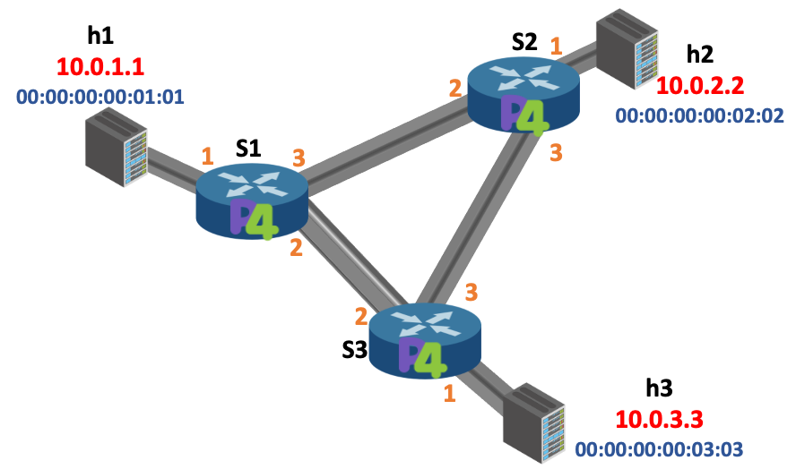

# P4Pi: P4 on Raspberry Pi for Research and Education 
## IEEE NetSoft 2022 tutorial

Introduction
-----------

All general information related to this tutorial is available on our [Wiki page](https://github.com/p4lang/p4pi/wiki/P4Pi-Tutorial-NetSoft-2022).

In this tutorial, we encourage participants to start with P4app to get familiar with P4 and develop their own P4 programs. Then the team will help participants to migrate the program to the Raspberry Pi and test.

Installation
------------

1. Install [docker](https://docs.docker.com/engine/installation/) if you don't
   already have it.

2. Clone the repository to local 

    ```
    git clone https://github.com/DINGDAMU/NetSoft_tutorial_2022.git    
    ```

3. ```
    cd NetSoft_tutorial_2022
   ```
4. ```
   ./p4app
   ```
When you run p4app at the first time, it will take some time to download the docker image.

5. You are ready!

Network topology
--------

The network topology used in our tutorial is triangular, and each host connects to a switch. The details of hosts (i.e., `h1`, `h2`, and `h3`) and switches (i.e., `S1`, `S2`, and `S3`) are shown in the figure.

Exercise I: L2 switching
--------------

### Step 1: Run the (incomplete) starter code
1.  ```
    ./p4app run l2switch.p4app 
    ```
    After this step you'll see the terminal of **mininet**

2. Try to ping between hosts in the topology:
```
mininet> pingall
```
or 
```
mininet> h1 ping h2
```
At the moment there should be no connection between hosts

### Step 2: Implement the forwarding logic

The `l2switch.p4` file contains a skeleton P4 program with key pieces of
logic replaced by `TODO` comments. Your implementation should follow
the structure given in this file---replace each `TODO` with logic
implementing the missing piece.

A complete `l2switch.p4` will contain the following components:

1. Header type definitions for Ethernet (`ethernet_t`) and IPv4 (`ipv4_t`).
2. **TODO:** Parsers for Ethernet and IPv4 that populate `ethernet_t` and `ipv4_t` fields.
3. An action to drop a packet, using `mark_to_drop()`.
4. **TODO:** An action (called `ipv4_forward`) that:
	1. Sets the egress port for the next hop.
	2. Updates the ethernet destination address with the address of the next hop.
	3. Updates the ethernet source address with the address of the switch.
	4. Decrements the TTL.
5. **TODO:** A control that:
    1. Defines a table that will read an IPv4 destination address, and
       invoke either `drop` or `ipv4_forward`.
    2. An `apply` block that applies the table.
6. **TODO:** A deparser that selects the order
    in which fields inserted into the outgoing packet.
7. A `package` instantiation supplied with the parser, control, and deparser.
    > In general, a package also requires instances of checksum verification
    > and recomputation controls. These are not necessary for this tutorial
    > and are replaced with instantiations of empty controls.

### Step 3: Populate flow rules
There is a control plane logic here: you need to define different flow rules in each switch so that they know how to forward the traffic to the destination.  
`commands1.txt`, `commands2.txt`, `commands3.txt` represent the rules for the tables in the switch `S1`, `S2`, and `S3`, respectively.

The format of adding flow rules in `commands[1-3].txt` should be like:
```
table_add [table name] [action name] [table key] => [action parameter] [action parameter 2] [...]
```
An example using ipv4_lpm table in `l2switch.p4`:
```
table_add ipv4_lpm ipv4_forward 10.0.1.1/32 => 00:00:00:00:01:01 1
```

### Step 4: Run your solution
If the P4 program and the defined flow rules are correct, it is possible to reach all hosts by using `pingall` in mininet:

```
mininet> pingall
*** Ping: testing ping reachability
h1 -> h2 h3
h2 -> h1 h3
h3 -> h1 h2
```

Alternatively, if you want to know more information about the packets, open a terminal (not in mininet):
```
p4app exec m h2 python3 receive.py
```
Open another terminal:
```
p4app exec m h1 python3 send.py h2 "hello"
```
Then you should be able to see the packet contents:
```
sniffing on h2-eth0
got a packet
###[ Ethernet ]###
  dst       = 00:00:00:00:02:02
  src       = 00:00:00:00:02:02
  type      = 0x800
###[ IP ]###
     version   = 4
     ihl       = 5
     tos       = 0x0
     len       = 45
     id        = 1
     flags     =
     frag      = 0
     ttl       = 62
     proto     = tcp
     chksum    = 0x65c8
     src       = 10.0.1.1
     dst       = 10.0.2.2
     \options   \
###[ TCP ]###
        sport     = 54670
        dport     = 1234
        seq       = 0
        ack       = 0
        dataofs   = 5
        reserved  = 0
        flags     = S
        window    = 8192
        chksum    = 0x5aa8
        urgptr    = 0
        options   = []
###[ Raw ]###
           load      = 'hello'
```


Exercise II: calculator
--------------

### Step 1: Run the (incomplete) starter code
1.  ```
    ./p4app run calc.p4app 
    ```
    After this step you'll see the terminal of **mininet**

2. Open another terminal and enter calc.p4app folder
   ```
    cd calc.p4app 
   ```

3. Copy required scripts to the hosts
   ```
    ./install_scripts.sh
   ```

4. We've written a small Python-based driver program that will allow
you to test your calculator. You can choose one of the hosts (i.e., `h1`, `h2` or `h3`) and run the following command in a new terminal:
```
./p4app exec m h1 python3 cal.py
```
or
```
./p4app exec m h2 python3 cal.py
```
or
```
./p4app exec m h3 python3 cal.py
```

5. The driver program will provide a new prompt, at which you can type
basic expressions. The test harness will parse your expression, and
prepare a packet with the corresponding operator and operands. It will
then send a packet to the switch for evaluation. When the switch
returns the result of the computation, the test program will print the
result. However, because the calculator program is not implemented,
you should see an error message.

```
> 1+1
Didn't receive response
>
```

### Step 2: Implement Calculator

To implement the calculator, you will need to define a custom
calculator header, and implement the switch logic to parse header,
perform the requested operation, write the result in the header, and
return the packet to the sender.

We will use the following header format:

             0                1                  2              3
      +----------------+----------------+----------------+---------------+
      |      P         |       4        |     Version    |     Op        |
      +----------------+----------------+----------------+---------------+
      |                              Operand A                           |
      +----------------+----------------+----------------+---------------+
      |                              Operand B                           |
      +----------------+----------------+----------------+---------------+
      |                              Result                              |
      +----------------+----------------+----------------+---------------+


-  P is an ASCII Letter 'P' (0x50)
-  4 is an ASCII Letter '4' (0x34)
-  Version is currently 0.1 (0x01)
-  Op is an operation to Perform:
 -   '+' (0x2b) Result = OperandA + OperandB
 -   '-' (0x2d) Result = OperandA - OperandB
 -   '&' (0x26) Result = OperandA & OperandB
 -   '|' (0x7c) Result = OperandA | OperandB
 -   '^' (0x5e) Result = OperandA ^ OperandB


We will assume that the calculator header is carried over Ethernet,
and we will use the Ethernet type 0x1234 to indicate the presence of
the header.

Given what you have learned so far, your task is to implement the P4
calculator program. There is no control plane logic, so you need only
worry about the data plane implementation.

A working calculator implementation will parse the custom headers,
execute the mathematical operation, write the result in the result
field, and return the packet to the sender.

### Step 3: Run your solution

Follow the instructions from Step 1.  This time, you should see the
correct result:

```
> 1+1
2
>
```

Test on Raspberry Pi
-------------------

Once finishing two hands-on exercises, you can come to tutors and test your program on a Raspberry Pi. We use calculator as an example here:
1. Compile the P4 program
```
p4c --target bmv2 --arch v1model --std p4-16 calc.p4
```
2. Run the compiled program. 
```
sudo simple_switch –i 0@eth0 calc.json
```
3. Run the python script provided
```
sudo python cal.py
```
4. Enter an equation and check if you get the correct results.
